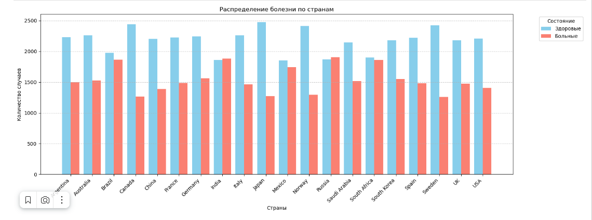
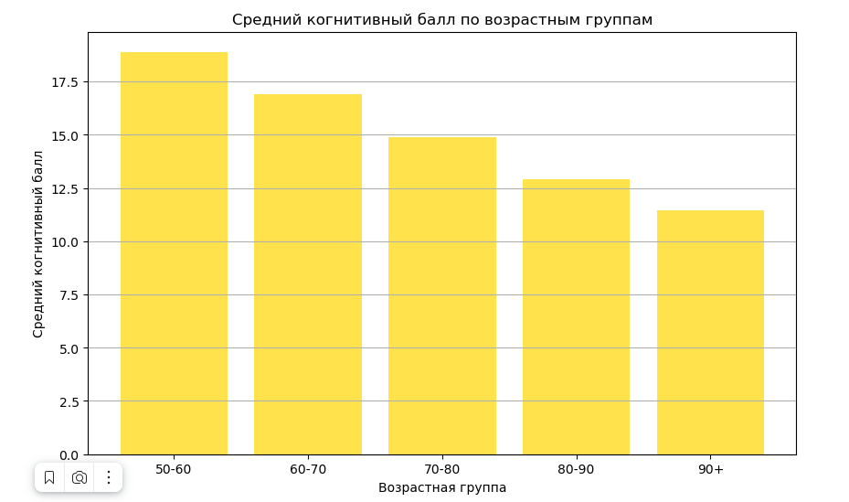
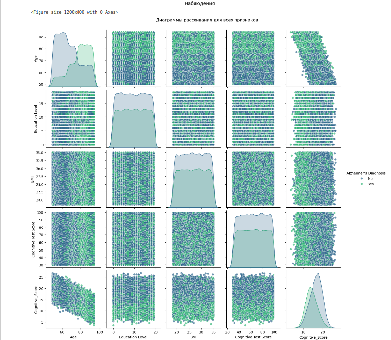
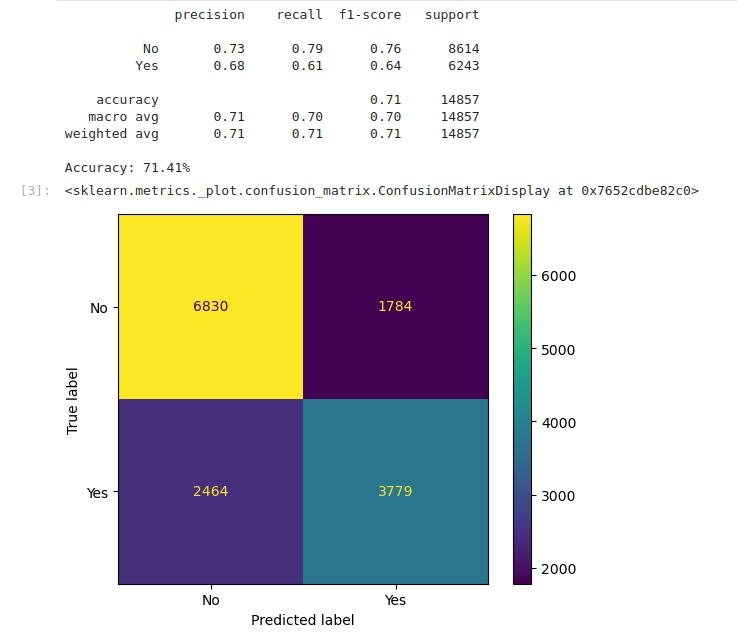
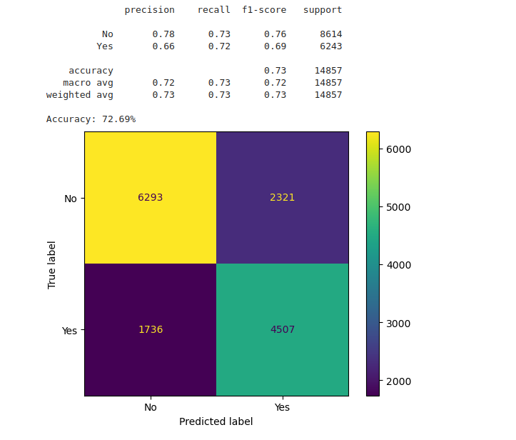

# Alzheimer's Disease Prediction Project

Проект направлен на анализ данных, связанных с болезнью Альцгеймера, и построение модели для предсказания диагноза на основе классификационных алгоритмов. Также реализована визуализация данных для анализа возрастных характеристик и когнитивных показателей.

# Используемые технологии
Проект построен на следующих технологиях и библиотеках:

- Python 3.9
- Pandas для обработки данных.
- Matplotlib и Seaborn для визуализации данных.
- Scikit-learn для построения модели машинного обучения.

# Функционал проекта
Проект включает следующие возможности:

- Загрузка данных (Данные загружаются из CSV-файла data/alzheimers_prediction_dataset.csv.)
- Обрабатываются возрастные характеристики и когнитивные показатели.
- Визуализация
- Линейный график зависимости между возрастом и когнитивным показателем.
- Scatter plot для анализа диагноза.
- Модель предсказания
- Метрики классификации (Precision, Recall, F1-Score, Accuracy) отображаются в консоли.

# Примеры графиков
1. 
2. 
3. 

# Примеры модели предсказания
1. 
2. 

# Вывод по анализу данных и модели предсказания болезни Альцгеймера
1. Анализ данных
- Датасет содержит данные о пациентах, включая возраст, когнитивные показатели и диагноз болезни Альцгеймера.
- Основные характеристики данных:
- Возраст пациентов распределён в диапазоне от 50 до 90 лет.
- Когнитивный показатель (Cognitive_Score) показывает умеренную взаимосвязь с возрастом: с увеличением возраста когнитивные способности, как правило, снижаются.
- Дисбаланс классов: больше пациентов с диагнозом No (здоровых), чем с диагнозом Yes (болезнь Альцгеймера).
- Модель способна предсказывать диагноз болезни Альцгеймера с точностью более 72%, что является хорошим результатом для базового классификатора.